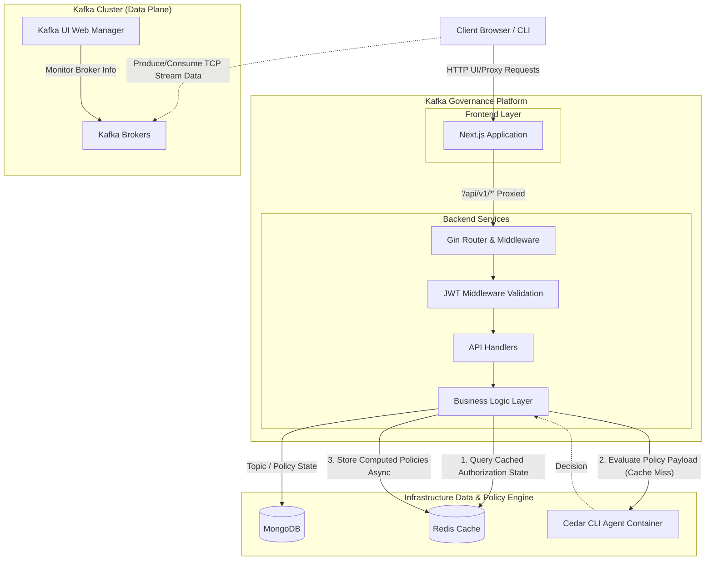
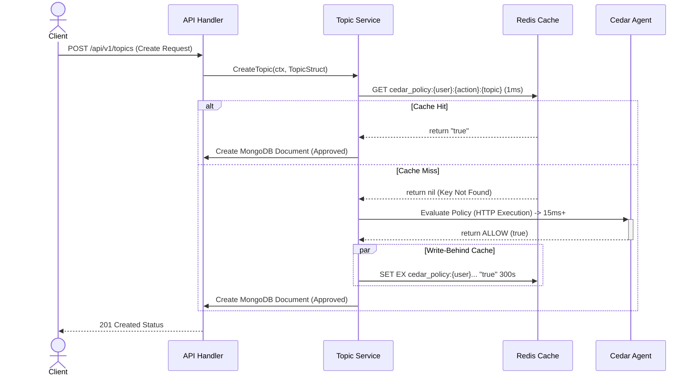

# Kafka Governance Control Plane Architecture

This document describes the high-level architecture of the Kafka Governance proxy including the newly added caching infrastructure components.

## High-Level Design (HLD)

### Components overview

1. **Frontend**: Next.js 14 client mapping React architectures and dynamically proxying authorization bounds natively securely.
2. **Auth Middleware**: Parses and validates the JWT decoupled locally. It injects the `userId` and user `role` onto the request context targeting API route maps.
3. **Service Layer**: Maps business workflows. When a user requests to `Create Topic`, it triggers the application to query the defined policies through the authentication topology.
4. **Data Plane**: Uses MongoDB instance for persisting structured elements like `Topic` & `Policy` logic natively decoupled.
5. **Caching Layer (Redis)**: Deployed to significantly accelerate latency-intensive validation hits targeted dynamically against AWS Cedar. By evaluating policies mapped across identity and resources rapidly and locally caching them securely, the payload execution minimizes external container networking blocks dramatically over heavily loaded infrastructures.
6. **Policy Engine (AWS Cedar)**: Running securely decoupled. Analyzes `Principal` (User), `Action` (e.g. `CreateTopic`), `Resource` (e.g., `orders.topic`), and evaluates them.

---

## Low-Level Design (LLD): Policy Evaluation Sequence

This illustrates the exact sequence during an authorization enforcement phase where Redis reduces latency intelligently.

